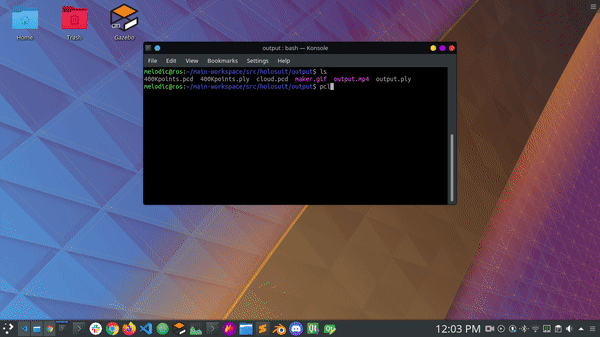
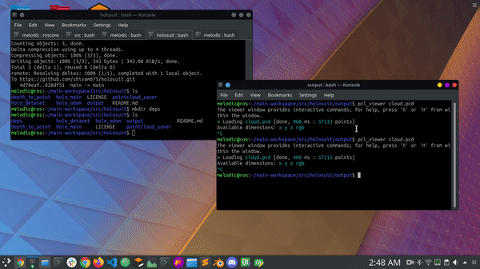

# holosuit
Following repo is the solution to the interview asignment @ holosuit

# Clone repo instructions
```sh
git clone https://github.com/shivam675/holosuit.git
```

## OUTPUT DEMO OF ORIGINAL POINTCLOUD



## OUTPUT DEMO OF VOXEL DOWN SAMPELING OF SINGLE MESSAGE INSTANCE {Unregistered cloud}


### Check the full video here:
[2+ mins of video](https://drive.google.com/file/d/19iQAItUQR9pB_nmuCQQGqmKoLbW1-V2t/view?usp=sharing)


# Major Dependencies packages:
1. Image_pipeline --> `https://github.com/ros-perception/image_pipeline.git`
2. Python-pcl strawlabs --> `https://github.com/strawlab/python-pcl.git`
3. pcl-tools --> `sudo apt install pcl-tools`
4. point_cloud2 msg ros --> `http://docs.ros.org/en/melodic/api/sensor_msgs/html/msg/PointCloud2.html`
5. rtab_map --> `http://introlab.github.io/rtabmap/`


#### Use the following commands to install few binary deps 
```sh
sudo apt install ros-melodic-rtabmap*
```
```sh
sudo apt install pcl-tools
```


**Thanks to the dataset from tum.de**


### How to build:
- In terminal 
```sh 
catkin_make -DCMAKE_BUILD_TYPE=Release -j$(nproc) 
``` 
- source the workspace
- Download the dataset from here and place it in the holo_dataset package
```sh 
wget https://vision.in.tum.de/rgbd/dataset/freiburg1/rgbd_dataset_freiburg1_xyz.bag
```

## Topics in the bag file are:
- camera/depth/camera_info
- /camera/depth/image
- /camera/rgb/camera_info
- /camera/rgb/image_color
- /clock
- /cortex_marker_array
- /imu
- /tf

## Topics after depth registration are:
- /cortex_marker_array
- /nodelet_manager/bond
- /points    {POINT_CLOUD2 MSG} --> unregistered


## Major topics after rtabmap 
- /rtabmap/cloud_map {Registered point cloud in point_cloud2 msg}
- /odom {odometry msg | visual odometry using the counters retained algorithm}


### How to run:
#### FOR IRL
<!-- 1. To open arm in Gazebo | Terminal 1: `roslaunch arm_gazebo gazebo_spawn.launch` -->
<!-- 2. To open arm in Rviz   | Terminal 2: `roslaunch arm_prismatic_octomap bringup.launch` -->
1. Run **rosbag play** file | Terminal 1 (rosbag):
```sh 
rosbag play rgbd_dataset_freiburg1_xyz.bag
```
2. Run **depth_to_point.launch** fine | Terminal 2 (image_depth_proc node): 
```sh 
roslaunch depth_to_point rtabmap.launch
```
3. Run **saver.sh** file | Terminal 3
```sh 
rosrun pointcloud_saver saver.sh
```

# Tested on System config 1:
- Hardware: i3 quad thread AMD64
- ROS: Melodic
- OS: Ubuntu 18.04 LTS
- processor arch: 2-core AMD64 Arch
- 8 GB 1666 MHz RAM
- Intel HD GPU 4000

# Done Part:
1. Point cloud registration via depth_image_proc package in image_pipeline
2. Added odometry visualization
3. Export pointcloud in .ply extenstion